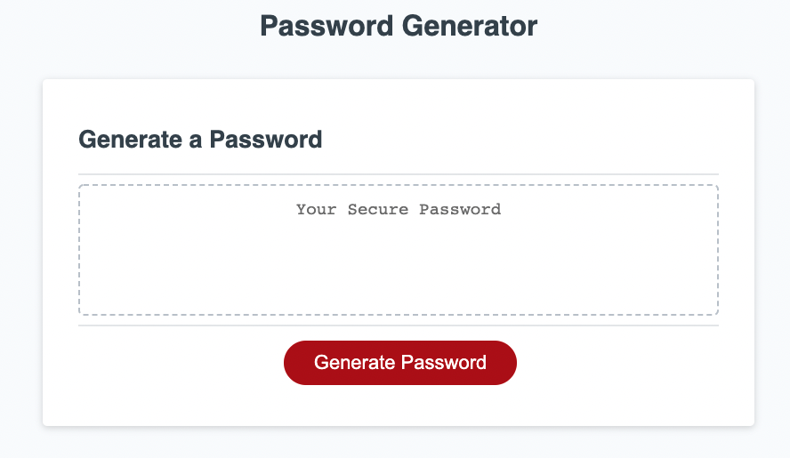

# 
<strong>Password Generator </strong>

### In this challenge, we are instructed to output a random password, given specific user inputs through window prompts 
 

### Challenge Criteria 

- When the "generate password" button is clicked, a series of windows prompts should open

 

- User must be asked how many characters the password should include 
    -  Must be at least 8 characters and no more than 128 characters
    
 

- User must be asked if uppercase, lowercase, or special characters should be included
    - lowercase letters choosen as default case

 

- When all prompts are answered, a password is generated in the password field 

----------------------

### 
 LINK TO WEBPAGE 

 

 [Password Generator](https://alessandrob96.github.io/PasswordGenerator/)   
 
 

